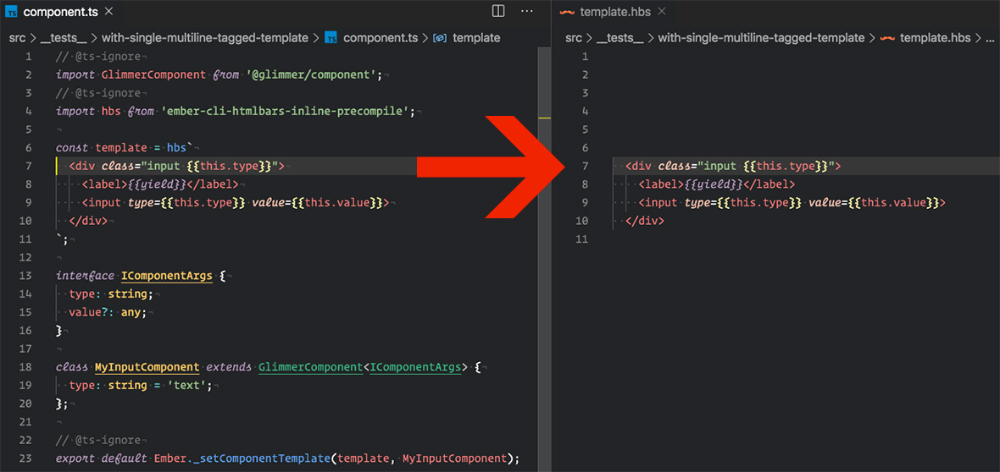

Extract tagged template literals
==============================================================================

Search and extract **ember inline templates** from script file(js/ts) using the `import declarations`.



Installation
------------------------------------------------------------------------------

```bash
# not published yet
yarn add ember-extract-inline-templates
```

Usage
------------------------------------------------------------------------------

API:

```ts
searchAndExtractHbs(source: string, options?: ISearchAndExtractHbsOptions): string | never;

getTemplateNodes(source: string, options?: IGetTemplateNodesOptions): ITemplateNode[];
```

Options:

- `hbsTagSources` - [Optional] The **additional** hbs tag sources used in the import declaration(s), e.g.:
  ```js
  {
    "hbs-source-with-default-export": "default", // import hbs from 'hbs-source-with-default-export';
    "hbs-source-with-named-export" : "handlebars", // import { handlebars } from 'hbs-source-wth-named-export';
    "hbs-source-with-renamed-export": "hbs" // import { hbs as h } from 'hbs-source-with-renamed-export';
  }
  ```

  Default hbs tag sources:
  ```js
  {
    "ember-cli-htmlbars": "hbs",
    "htmlbars-inline-precompile": "default",
    "ember-cli-htmlbars-inline-precompile": "default",
    "@glimmerx/component": "hbs",
    "@glimmer/core": ["createTemplate", "precompileTemplate"]
  }
  ```

- `parse` -  parser function.
  ```js
    // usage example #1
    import { parse } from 'babylon';
    function parseFunction(source) {
      return parse(source, { sourceType: 'module', plugins:  ['classProperties', 'flow'] });
    }
    getTemplateNodes(source, { parse: parseFunction });

  ```

  ```js
    // usage example #2
    import { parseScriptFile } from 'ember-meta-explorer';
    function parseFunction(source) {
      return parseScriptFile(source);
    }
    getTemplateNodes(source, { parse: parseFunction });
  ```
- `sortByStartKey` - [Optional] The extracted template nodes from the **ast** will not be ordered by their original
 position in the source, so we can sort them using the `start` key, `false` by default.

### Example
```ts
import { searchAndExtractHbs } from 'ember-extract-inline-templates';

const source = `
  import GlimmerComponent from '@glimmer/component';
  // @ts-ignore
  import hbs from 'ember-cli-htmlbars-inline-precompile';

  const template = hbs\`
    <div class="input {{this.type}}">
      <label>{{yield}}</label>
      <input type={{this.type}} value={{this.value}}>
    </div>
  \`;

  interface IComponentArgs {
    type: string;
    value?: any;
  }

  class MyInputComponent extends GlimmerComponent<IComponentArgs> {
    type: string = 'text';
  };

  // @ts-ignore
  export default Ember._setComponentTemplate(template, MyInputComponent);
`;

const hbs = searchAndExtractHbs(source);
console.log(hbs);
```
Output:
```hbs


    <div class="input {{this.type}}">
      <label>{{yield}}</label>
      <input type={{this.type}} value={{this.value}}>
    </div

```

Todo
------------------------------------------------------------------------------
- Add CI tool(Travis, CircleCI...)
- Add other advanced examples to README.md.
- Add other test cases.

Contributing
------------------------------------------------------------------------------

### Installation

* `git clone <repository-url>`
* `cd ember-extract-inline-templates`
* `yarn install`

### Linting

* `yarn lint`

### Running test

* `yarn test`

